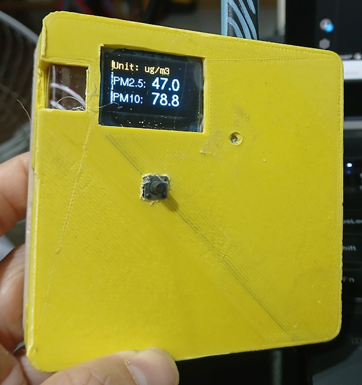
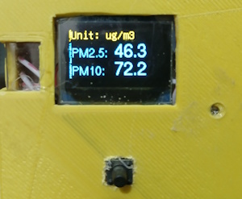
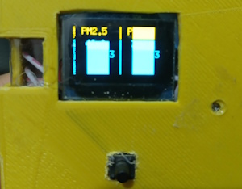
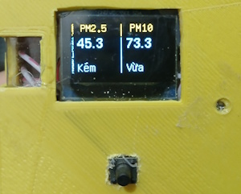
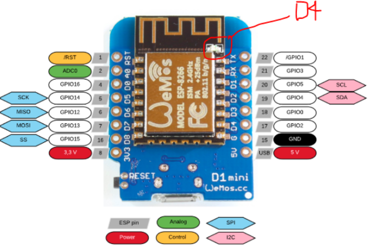
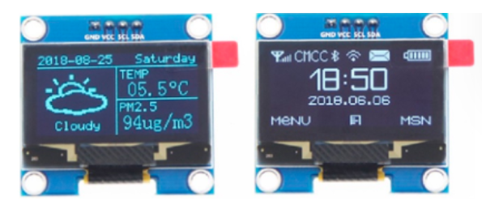
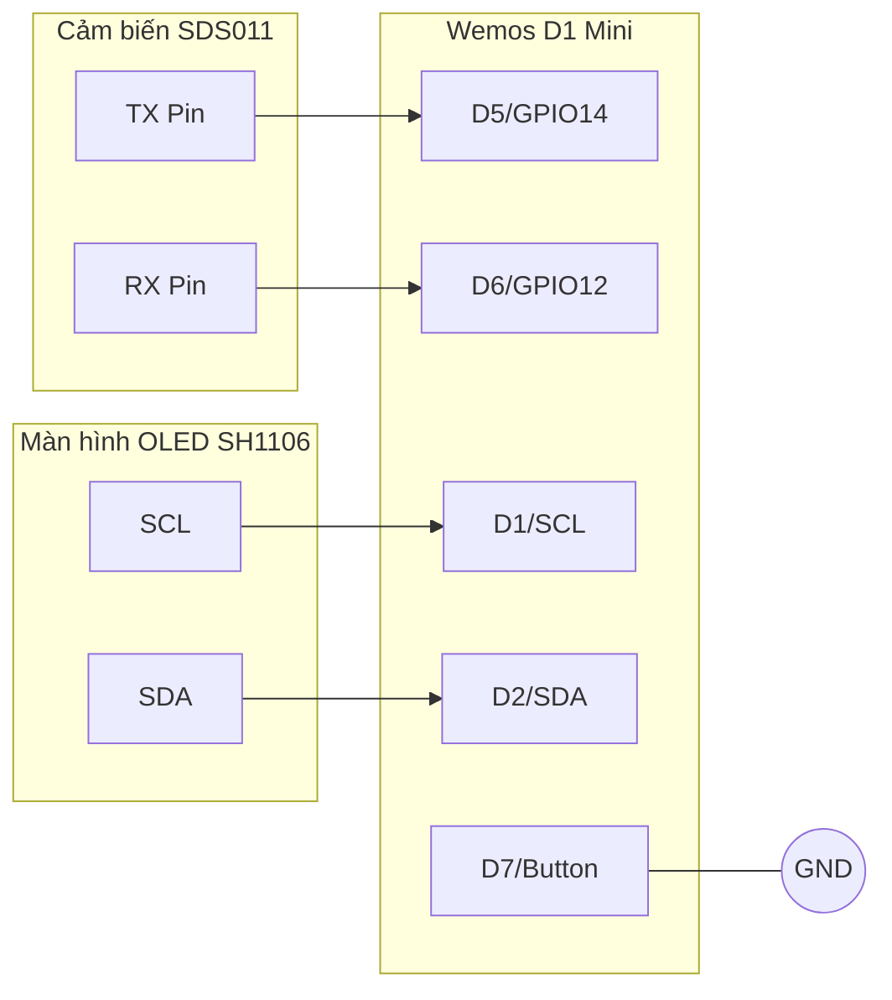
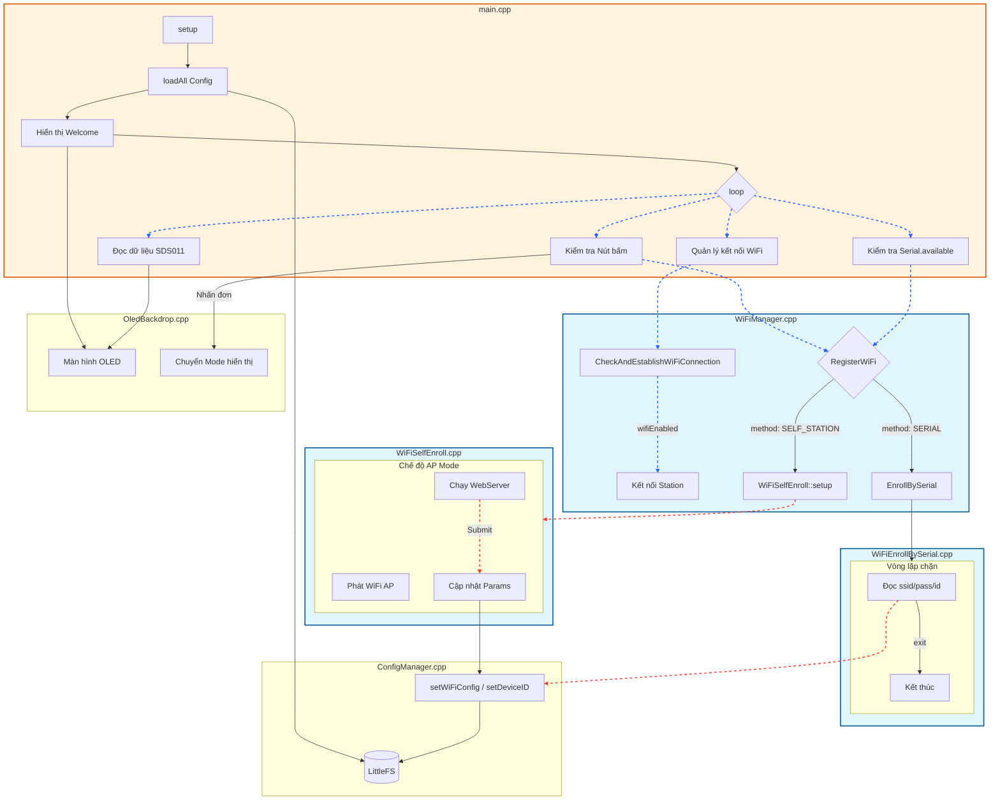
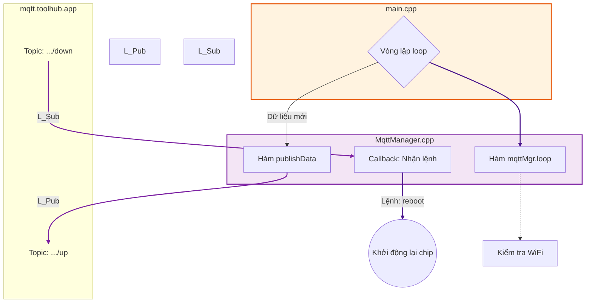
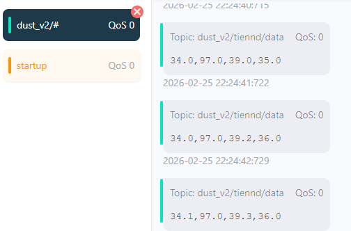

# THIẾT BỊ QUAN TRĂC BỤI MIN

Chương trình được thiết kế cho vi điều khiển Wemos D1 Mini (ESP8266) để đo nồng độ bụi mịn trong không khí sử dụng cảm biến SDS011.

Hệ thống cung cấp khả năng theo dõi thời gian thực các chỉ số PM2.5 và PM10, đồng thời tính toán chỉ số chất lượng không khí AQI theo tiêu chuẩn US EPA. Dữ liệu được hiển thị trực quan trên màn hình OLED 1.3 inch và có khả năng kết nối WiFi để quản lý từ xa.

__Các tính năng chính:__

- Đọc dữ liệu từ cảm biến SDS011 qua Serial ảo (SoftwareSerial).
- Tính toán AQI và đưa ra nhận xét (Tốt, Vừa, Kém, Hại).
- Lưu trữ lịch sử 16 mẫu gần nhất để vẽ đồ thị.
- Quản lý cấu hình WiFi (SSID, Password) lưu trong bộ nhớ Flash (LittleFS).
- Chế độ tiết kiệm năng lượng (Tắt/Bật WiFi bằng nút bấm).
- Thiết bị hiển thị mức bụi min PM2.5 và PM10 theo 3 cách:

__Thông tin về bụi:__

1. Hiển thị trên màn hình
2. Gửi qua serial (cổng usb) về máy tính gới giá trị dạng text
3. Gửi về máy chủ MQTT tại <mqtt.toolhub.app>



Mặt khác, một đèn led chỉ thị _(led built-in D4 trên board Wemos D1 R2 mini)_ sáng mỗi khi bấm __nút chuyển trạng thái__ hiển thị.

  

## Giao diện và Điều khiển

### Các màn hình hiển thị (g_mode)

Hệ thống có 4 chế độ hiển thị, chuyển đổi bằng cách nhấn nút:

- MODE_INFO (Thông tin hệ thống): Hiển thị ID thiết bị, tên WiFi đang kết nối và trạng thái kết nối hiện tại.
- MODE_IMMEDIATE (Giá trị tức thời): Hiển thị nồng độ PM2.5 và PM10 thô với đơn vị $ug/m^3$.
- MODE_PLOT (Đồ thị): Hiển thị đồ thị đường (line chart) của 16 mẫu AQI gần nhất cho cả PM2.5 và PM10.
- MODE_AQI (Kết luận): Hiển thị chỉ số AQI đã tính toán kèm nhận xét bằng tiếng Việt về mức độ ô nhiễm.2.

### Điều khiển nút bấm (D7)

Sử dụng thư viện tùy biến ButtonGestures để nhận diện nhiều loại thao tác trên một nút duy nhất:

Thao tác | Hành động
-- | --
Nhấn đơn (Short Press) | Chuyển đổi qua lại giữa 4 chế độ màn hình.
Nhấn đúp (Double Click) | Bật hoặc Tắt kết nối WiFi. Điều kiện: chỉ áp dụng trong màn hình MODE_INFO.
Nhấn giữ 2 giây | Kích hoạt chế độ AP Config (Phát WiFi để cấu hình thông tin mạng mới).

## Bảng tra chất lượng không khí theo bụi

Đơn vị đo: Nồng độ bụi (µm/m3)

|Chất lượng không khí chung|PM10 (Bụi thô)|PM2.5 (Bụi mịn)|PM1.0 (Bụi siêu siêu mịn)|
|--|--|--|--|
|Hại |255 trở lên |56 trở lên |56 trở lên |
|Kém|155 - 254|36 - 55|36 - 55|
|Vừa phải|55 - 154|13 - 35|13 - 35|
|Tốt|54 trở xuống|12 trở xuống|12 trở xuống|

Tham khảo: <https://www.studocu.vn/vn/document/truong-dai-hoc-thu-dau-mot/quan-ly-moi-truong/2022-world-air-quality-report-vi/111575198>

## Thiết kế board

### Danh sách vật tư

1. [Board điều khiên trung tâm Wemos D1 R2 mini](https://github.com/neittien0110/MCU/blob/master/ESP8266/Wemosd1r2mini.md)
2. [Module cảm biến bụi SDS011](https://github.com/neittien0110/linhkiendientu/?tab=readme-ov-file#b%E1%BB%A5i)
3. [Màn hình Oled 1"3 để hiển thị mức bụi trực tiếp](https://github.com/neittien0110/linhkiendientu/blob/master/Screens.md)
4. Nút bấm để chuyển trạng thái hiển thị

### Kết nối




STT|Module 1|Module
--|--|-
1|Wemos D1 R2 / Pin 5V|SDS011 / Pin 5V
2|Wemos D1 R2 / Pin G|SDS011 / Pin G
3|Wemos D1 R2 / Pin RX (D5=GPIO3)|SDS011 / Pin TX
4|Wemos D1 R2 / Pin TX (D6=GPIO1)|SDS011 / Pin R X
--|--|-
1|Wemos D1 R2 / Pin 3v3|Oled / Pin VCC
2|Wemos D1 R2 / Pin G|Oled / Pin GND
3|Wemos D1 R2 / Pin D1=SCL (GPIO5)|Oled / Pin SCL
4|Wemos D1 R2 / Pin D2=SDA (GPIO4)|Oled / Pin SDA
--|--|-
1|Wemos D1 R2 / Pin D7 (GPIO13)|Nút bấm / Pin 1
2|Wemos D1 R2 / Pin G|Nút bấm / Pin 2
--|--|-
0|Wemos D1 R2 / USB|Nguồn cấp 5V
0|Wemos D1 R2 / USB|Cổng serial 115200



## Nguyên tắc hoạt động và Sơ đồ

### Quy trình xử lý dữ liệu

Cảm biến SDS011 gửi một gói tin 10 byte qua Serial. Chương trình thực hiện kiểm tra mã bắt đầu (0xAA), mã kết thúc (0xAB) và tính toán Checksum để đảm bảo dữ liệu không bị nhiễu.

### Sơ đồ luồng hoạt động (Flowchart)



__Giao tiếp MQTT__



### Ví dụ về nội dung MQTT

- Server: mqtt.toolhub.app
- Port: 1883
- Protocol: mqtt
- User: demo
- Password: demo
- MQTT ClientID: __dust_v2-deviceid__  (Thay đổi bằng macro __MQTT_CLIENT_ID_PREFIX__)
- Topic __startup__ : write  (Thay đổi bằng macro __MQTT_TOPIC_STARTUP__)

  ```csv
    deviceid,ssid,mac,topic write,topic read
  ```

- Topic __dust_v2/deviceid/data__ : write với nội dung dạng (Thay đổi bằng macro __MQTT_TOPIC_UP_TEMPLATE__)

  ```csv
    pm2.5 ug/m3,pm2.5 AQI,pm10 ug/m3,pm10 AQI
  ```

- Topic __dust_v2/deviceid/cmd__ : read  (Thay đổi bằng macro __MQTT_TOPIC_DOWN_TEMPLATE__)
  - Lệnh khởi động lại thiết bị

    ```csv
    reboot
    ```



## Website xem số liệu

 [Website](./www/index.html)
